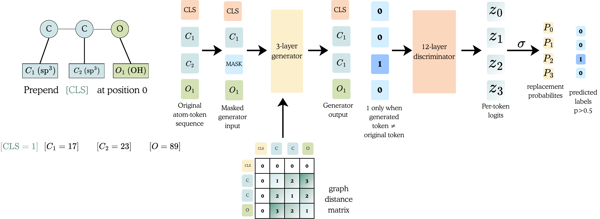

# GRASP

**Graph Representation Learning with Assay Supervision for Molecular Properties**

*Satya Pratik Srivastava · Rohan Gorantla · Sharath Krishna Chundru · Harshit Singh · Antonia S. J. S. Mey · Rajeev Kumar Singh*

Shiv Nadar University · University of Edinburgh

Molecular structures are plentiful. Experimental measurements are scarce, scattered across assays, and expensive to obtain. **GRASP learns from both:** it first learns the context of atoms in molecular graphs, then adapts that encoder using sparse bioactivity measurements. This repository releases the fixed **50,000-step Step 2 encoder** used in our paper, along with a direct path from molecular embeddings to a trained property predictor.

[Model weights and card](https://huggingface.co/caithmac/GRASP) · [Example notebooks](notebooks/) · [Paper reproduction](reproduction/README.md) · [Citation](#citation)

## How GRASP learns

**Structure → assays → your endpoint.** The first stage sees 1.54 billion ZINC20 molecule presentations. Each atom is a radius-0 Morgan token; a three-layer generator proposes replacements at selected positions, and a 12-layer graph Transformer detects which tokens actually changed. Shortest-path distances give its attention layers graph context. The second stage adapts the encoder on 511,898 ChEMBL 36 molecules with labels from 642 sparsely observed assays. A task-specific readout is then trained for each downstream property.



*The paper's graph replaced-token detection figure shows **Step 1**: 25% of atom positions are selected, and a token is labelled replaced only when the generator's proposal differs from the original. The 12-layer discriminator uses the resulting tokens and graph distances. [View the vector PDF](assets/model_architecture.pdf) for the full-size figure.*

The released model is the **Step 2 encoder**, after ChEMBL adaptation. It has 12 layers, width 768, 12 attention heads, 93.5 million parameters, and a 211-token vocabulary. It is a molecular representation model, not a ready-made experimental property predictor.


## Start with the notebooks

- **Extract embeddings:** [](https://colab.research.google.com/drive/1i-NLImnIBcnv-qn5sun0J0Xkuge8rGhG?usp=sharing)
- **Fine-tune, save, reload, predict:** [](https://colab.research.google.com/drive/1BcYhx7Jp_WPJFgvqRw_S53W3dge2CWfQ?usp=sharing)

Run cells from top to bottom. The fine-tuning notebook uses a small, **illustrative** RDKit-computed logP dataset; its output is not a paper benchmark. Select a GPU under **Runtime → Change runtime type** when available. Colab storage is temporary, so download any trained predictor you want to keep. The [versioned notebooks](notebooks/) are the source for these examples.

## Install and extract embeddings

Use Python 3.10–3.13. Install a PyTorch build suited to your CPU or CUDA system, then:

```bash
git clone https://github.com/caithmac/GRASP.git
cd GRASP
python -m pip install -e .
```

```python
from grasp import GRASPEncoder

encoder = GRASPEncoder.from_pretrained("caithmac/GRASP")
vectors = encoder.encode(["CCO", "c1ccccc1"])
print(vectors.shape)  # (2, 768)
```

The default representation is the **final-layer CLS embedding**. For a CSV containing a `smiles` column, run:

```bash
python -m grasp embed --model caithmac/GRASP \
  --input-csv molecules.csv --output-csv embeddings.csv
```

Invalid SMILES are reported with their row number. The encoder does not silently truncate molecules: it rejects inputs beyond 511 atoms, because one of its 512 positions is reserved for CLS. Structural pretraining used molecules of at most 96 heavy atoms, so much larger inputs can be outside its familiar distribution even when they fit.

## Fine-tune a property predictor

Provide separate `train.csv` and `valid.csv` files with explicit SMILES and target columns. For binary classification, targets must be `0` or `1`; for regression, predictions are returned in the target's original units. Keep validation structures separate when measuring transfer.

```bash
python -m grasp finetune \
  --model caithmac/GRASP \
  --train-csv train.csv --valid-csv valid.csv \
  --smiles-column smiles --target-column target \
  --task regression --method full --output-dir runs/my_property

python -m grasp predict \
  --model runs/my_property \
  --input-csv molecules.csv --output-csv predictions.csv
```

`full` is the default adaptation mode; `lora` and `frozen` are also available. The saved directory contains the encoder, learned readout and head, vocabulary, task settings, and regression target scaling needed to reload predictions. Binary predictions are probabilities for class 1.

## Checkpoint and reproduction

The original 50,000-step Step 2 state dict has SHA-256 `7940ca66fc8f6785d6ae2e63b3965f69425e872cd28f4a975493fb1972742ee1`. The released `model.safetensors` is a tensor-identical conversion; [`scripts/prepare_model.py`](scripts/prepare_model.py) checks the source hash and every converted tensor. We publish the vocabulary and architecture configuration beside the weights on [Hugging Face](https://huggingface.co/caithmac/GRASP).

The [reproduction directory](reproduction/README.md) contains the sanitized training, evaluation, split, and provenance material. Raw ZINC20, ChEMBL, OpenADMET, and TDC data are not redistributed. GRASP uses 2D molecular graphs; it does not model 3D geometry or experimental uncertainty. Predictions from a fine-tuned head need domain checks and experimental validation.

## Citation

Satya Pratik Srivastava, Rohan Gorantla, Sharath Krishna Chundru, Harshit Singh, Antonia S. J. S. Mey, and Rajeev Kumar Singh. *GRASP: Graph Representation Learning with Assay Supervision for Molecular Properties.* Preprint (arXiv identifier pending). See [`CITATION.cff`](CITATION.cff) for machine-readable authorship. We will add the arXiv link when it is assigned.

## License and attribution

The adapted MolE-derived code and model retain [CC BY-NC 4.0](LICENSE) terms. The bundled DeBERTa code retains its [MIT license](vendor/DEBERTA_LICENSE). See [NOTICE](NOTICE) for attribution, and respect the terms of any datasets used for fine-tuning.
